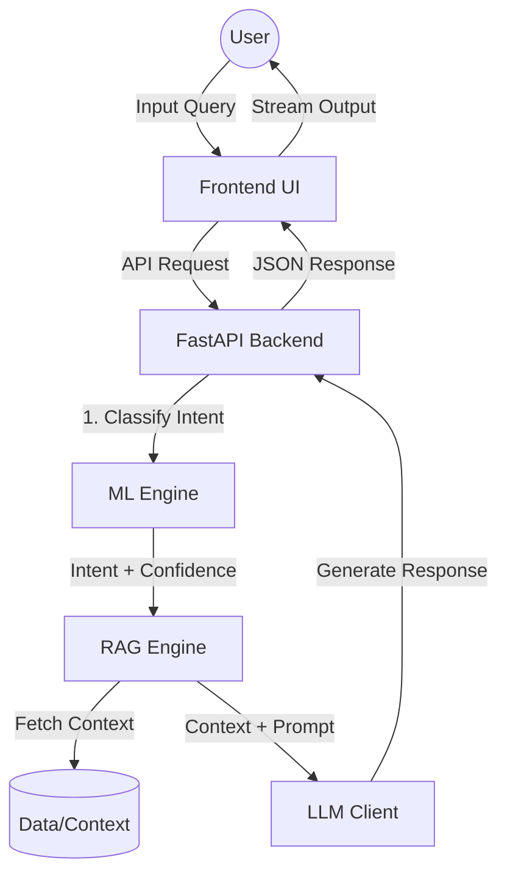

# Anavrin AI 🤖

Anavrin AI is a production-grade e-commerce customer support chatbot. It combines traditional Machine Learning (TF-IDF + Random Forest/Naive Bayes) for intent classification with state-of-the-art LLMs for contextual response generation.

---

## 🌟 Key Features

-   **Hybrid Intelligence**: Uses ML for precision classification and LLMs for natural conversation.
-   **Clean Architecture**: Modular backend structure for easy scaling and maintenance.
-   **AI-Native UI**: Modern, responsive dark-mode interface with real-time status tracking.
-   **Multi-Provider Support**: Seamlessly switch between NVIDIA NIM, OpenRouter, or local mock providers.
-   **Smart Fallback**: Automatically reverts to high-quality local templates if LLM APIs are unavailable.
-   **RAG Ready**: Built-in Retrieval-Augmented Generation (RAG) engine for product-specific context.

---

## 🏗️ Architecture



---

## 📂 Project Structure

```text
Anavrin-AI/
├── backend/                # FastAPI Application
│   ├── api/                # Pydantic schemas & API contracts
│   ├── chatbot/            # Core logic (LLM, ML Engine, RAG)
│   ├── config/             # Global configuration & path management
│   └── main.py             # Server entry point
├── frontend/               # UI Files (HTML, CSS, JS)
├── models/                 # Trained ML model artifacts (.joblib)
├── data/                   # Datasets & intent mappings
├── evaluation/             # Model performance metrics & graphs
├── requirements.txt        # Python dependencies
└── .env.example            # Environment variable template
```

---

## 🛠️ Setup & Installation

### 1. Prerequisites
- Python 3.9+
- (Optional) API key from [NVIDIA NIM](https://build.nvidia.com/) or [OpenRouter](https://openrouter.ai/)

### 2. Clone & Prepare Environment
```bash
# Clone the repository
git clone https://github.com/your-username/Anavrin-AI.git
cd Anavrin-AI

# Create a virtual environment
python -m venv venv

# Activate virtual environment
# Windows:
.\venv\Scripts\activate
# Mac/Linux:
source venv/bin/activate

# Install dependencies
pip install -r requirements.txt
```

### 3. Configuration
Copy the template environment file and fill in your details:
```bash
cp .env.example .env
```
Edit `.env` to set your `LLM_PROVIDER` and API keys.

### 4. Machine Learning Models
The pre-trained model artifacts are ignored in this repository due to their size. To run the application, you have two options:
1. **Download Artifacts**: Place your `tfidf.joblib` and model files in the `models/` folder.
2. **Train Locally**: Run the training script to generate new artifacts.
   ```bash
   python kaggle/train_kaggle.py
   ```

### 5. Running the Application
From the root directory, run:
```bash
uvicorn backend.main:app --reload
```
- **Backend API**: `http://localhost:8000/api/health`
- **Frontend UI**: `http://localhost:8000`

---

## 🧠 Machine Learning Pipeline

1.  **Preprocessing**: Normalizes user input (lowercase, special character removal).
2.  **Vectorization**: Uses a pre-trained TF-IDF vectorizer to convert text to numerical features.
3.  **Classification**: Predicts the intent (e.g., `refund`, `cancel_order`) using the best available model (Random Forest or Naive Bayes).
4.  **RAG Enrichment**: Fetches relevant context from the `data/` directory based on the classified intent.
5.  **Generation**: Combines intent, context, and conversation history into a prompt for the LLM to produce a human-like response.

---

## 📊 Evaluation & Metrics
You can find performance reports, including confusion matrices and accuracy scores, in the `evaluation/` directory. These are updated every time the model is retrained.

---

## 🤝 Contributing
Contributions are welcome! Please follow these steps:
1. Fork the Project.
2. Create your Feature Branch (`git checkout -b feature/AmazingFeature`).
3. Commit your Changes (`git commit -m 'Add some AmazingFeature'`).
4. Push to the Branch (`git push origin feature/AmazingFeature`).
5. Open a Pull Request.

---

Built with ❤️ by Anavrin AI Team.

